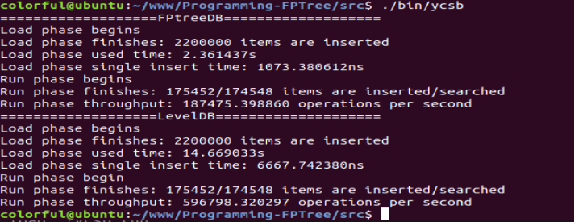
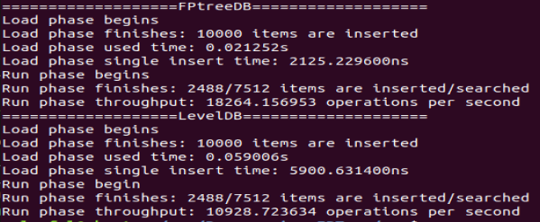
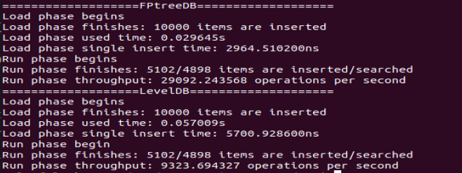
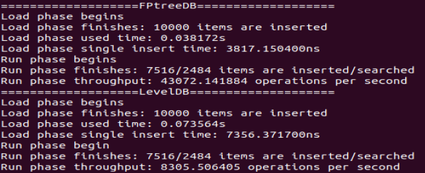
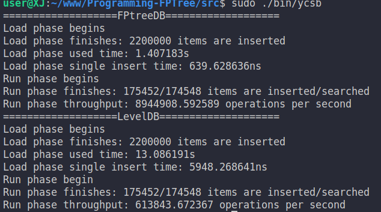

# www
DBMS Project
## 系统基本说明
本系统主要是基于针对NVM优化的数据结构FPTree，实现一个简单的键值存储引擎FPTreeDB。我们通过将其包装成一个调用库，供用户程序使用并管理其数据存储，与LevelDB的使用方式类似。对外可用的数据基本操作有增（insert）删（remove）改（update）查（find）。在系统恢复操作上，使用BulkLoading的方式。系统实现上主要是非叶子结点节点的结构类B+Tree、叶子节点要用PMDK与NVM进行数据交互。
## 作者
温鸿玮（17308164）、王俊焕（17308164）、王鑫基（17309084）
## 使用方法
### 使用环境  
Linux Ubuntu 14.0.4及以上
### 源码下载，使用  
```git clone https://github.com/colorfuljor/www.git```
### 编译链接  
在main函数中编写自己所用代码  
进入```./Programming-FPTree/src```输入```make```编译出可运行文件  
（若要在自己的代码文件里书写代码，最后要链接```fptree.cpp、p_allocator.cpp、utility.cpp```）  
### 函数接口  
1. ```FPTree::FPTree(uint64_t degree)```构造一个度为degree的FPTree  
2. FPTree中键值对数据类型  
```typedef uint64_t  Key;    // key(8 byte)```  
```typedef uint64_t  Value;  // value(8 byte)```  
3. ```void FPTree::insert(Key k, Value v)```向FPTree中插入键值对<k,v>  
4. ```bool FPTree::remove(Key k)```向FPTree中删除键k对应的数据项，成功则返回true，否则返回else  
5. ```bool FPTree::update(Key k, Value v); ```将FPTree中键k对应的值更新为v  
6. ```Value FPTree::find(Key k); ```获得FPTree中键k对应的值  
7. ```void FPTree::printTree()```以字符串形式打印树  

## fptree与levelDB性能对比



220w-50-50测试中，发现fptree插入效率是levelDB的6倍以上，而RUN阶段效率却比较低。

现在分析下面三次测试，三次测试insert/search比率依次增大。  
load阶段fptree有绝对优势。
run阶段fptree的吞吐量依次为18264, 29092, 43072，
levelDB吞吐量依次为10928， 9323， 8305。  
由此可见fptree插入效率高，查询效率低，而levelDB则相反。







### fptree查询效率低的原因

fptree叶子节点中的键值对是无序的，我们使用了fingerprint，在对比fingerprint时调用的keyHash,我们注释掉相关函数，不使用fingerprint机制后，发现性能大大提升，fptree的插入删除都比levelDB效率高，如下图。  
fptree中的fingerprint是否有存在的必要呢？




## 测试方法

### [2019/5/30]可进行fptree与levelDB的性能对比测试  

1. 在终端进入到```./Programming-FPTree/src``` 输入```make```编译运行出可运行文件(先进行```make clean```)  
2. 进入```./Progaming-FPTree/src``` 输入```./bin/ycsb```即可进行性能对比测试  
3. 如果希望修改所用的测试文件，可以修改```./Programing-FPTree/src/ycsb.cpp```行11、12、14的文件名，文件路径在```./Programing-FPTree/workload```中  

### [2019/5/30]可进行删除操作的测试
1. 在终端进入到```./Programing-FPTree/test``` 输入```make```编译运行出可运行文件
2. 进入```./Programing-FPTree/test/bin``` 输入```./utility_test```即可测试系统分配叶子空间，````./fptree_test```即可测试叶子结点的删除操作

### [2019/5/18]可进行系统查询和更新操作的测试
1. 在终端进入到```./Programing-FPTree/test``` 输入```make```编译运行出可运行文件
2. 进入```./Programing-FPTree/test/bin``` 输入```./utility_test```即可测试系统分配叶子空间，```./fptree_test```即可测试叶子结点的查询和更新操作

### [2019/5/11]可进行系统分配叶子空间以及树节点插入的测试
1. 在终端进入到```./Programing-FPTree/test``` 输入```make```编译运行出可运行文件
2. 进入```./Programing-FPTree/test/bin``` 输入./utility_test即可测试系统分配叶子空间，```./fptree_test```即可测试叶子结点的插入操作  

### [2019/5/4]系统尚未完成，只能进行系统分配节点的测试，增删改查功能尚未完成。
1. 进入到```./Programing-FPTree/test``` 新建data文件夹或修改p_allocator.h内路径
2. 在终端进入到```./Programing-FPTree/test``` 输入```make```编译运行出可运行文件
3. 进入```./Programing-FPTree/test/bin``` 输入```./utility_test```即可测试  

## 实现时间计划
1. 5月4日前：系统说明书，PAllocator实现并通过utility测试，LevelDB的使用以及测试（对应lycsb.cpp，p_allocator.cpp的实现和运行，utility_test.cpp的运行）
2. 5月4日-5月11日：FPTreeDB插入和重载操作并通过相关测试（对应fptree.cpp的实现和fptree_test.cpp部分的运行）
3. 5月11日-5月18日：FPTreeDB查询和更新操作并通过相关测试（对应fptree.cpp的实现和fptree_test.cpp部分的运行）
4. 5月18日-5月31日：FPTreeDB删除操作和所有剩下实现以及测试（对应fptree.cpp的实现和fptree_test.cpp所有的运行）

## 实现进度  
### [2019/5/30]完成树的叶子结点的删除   
1.完成```InnerNode::remove()```相关操作，其间递归调用remove(),遇到子结点删除不满足degree的约束条件时就重定位，如果不能重定位就进行merge操作。  
2.完成```InnerNode::restributeLeft()、InnerNode::restributeRight()```分别为与左兄弟重定位操作、右兄弟重定位操作。  
3.完成```InnerNode::mergeLeft()、InnerNode::mergeRight()、InnerNode::mergeParentLeft()、InnerNode::mergeParentRight()```的合并操作。 

### [2019/5/18]完成树的叶子节点的查询、更新
1. 完成```InnerNode::find(const Key& k)```递归地查询，最终调用```LeafNode::find(const Key& k)```循环查询到符合条件的键值，查询失败则返回```MAX_VALUE```
2. 完成```InnerNode::update(const Key& k, const Value& v)```递归地查询，最终调用```LeafNode::update(const Key& k, const Value& v)```进行实际地键值更新，查询方式与find函数相同，更新后需调用persist()进行数据持久化
3. 修补```p_allocator.cpp```中getleaf与freeleaf的关于startLeaf的更新，并增加了数据持久化

### [2019/5/11]完成树的叶子节点的插入、重载
1. 完成```InnerNode::findIndex(Key)```二分查找找到键插入的合适下标
2. 完成```InnerNode::insertNonFull(Key,Node *)、InnerNode::insert(Key,value&)、InnerNode::insertLeave(Keynode&)```递归的插入非叶子键值，最终插入叶子结点
3. 完成```InnerNode::split()```中间结点的分裂
4. 完成```FPTree::bulkloading()```,利用```pAllocator->startLeaf```以链表形式载入，通过```root->insertLeave()```插入结点  

### [2019/5/4]PAllocator.cpp实现、通过utility测试、通过LevelDB测试
1. LevelDB是google实现的键值数据库。我们需要学会文件读写、调用LevelDB的接口完成相应写入、读取（增删改查）功能。我们通过编写lycsb.cpp实现将workload中的txt文件转化为键值对，存入到LevelDB中，并对LevelDB功能进行测试。
2. PAlloctor是NVM文件管理的主要对象，负责分配LeafNode在NVM的空间，映射数据文件并返回虚拟地址给LeafNode使用。主要实现叶结点的分配、get、free方法，该过程需要使用到PMDK的libpmem库对NVM进行操作。