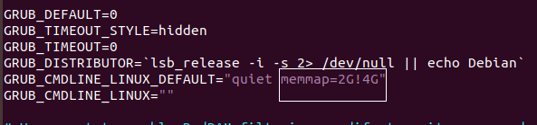
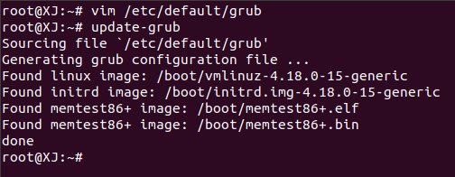
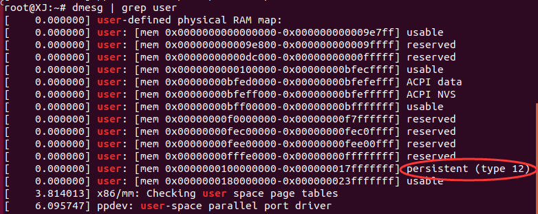
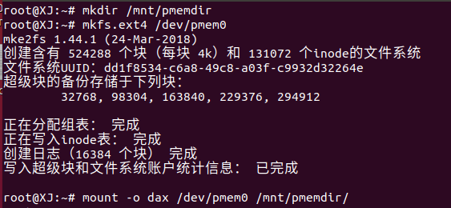
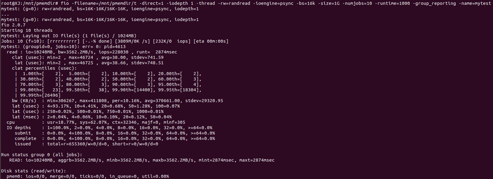
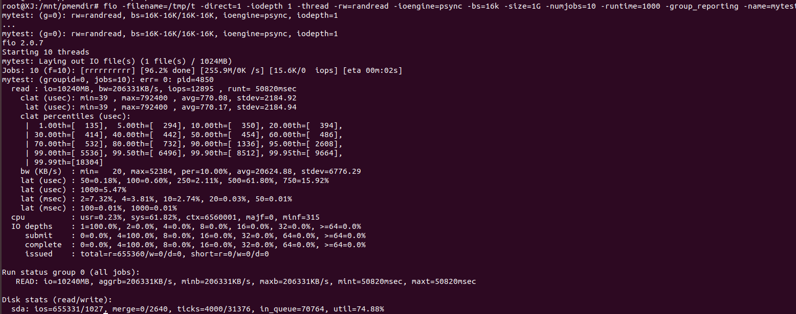
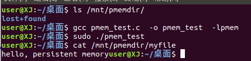

# 论文阅读与前期工作总结
### 姓名：温鸿玮，王俊焕，王鑫基
### 学号：17308164，17308154，17309084
--
## 前期工作

### 使用示意图展示普通文件IO方式(fwrite等)的流程，即进程与系统内核，磁盘之间的数据交换如何进行？为什么写入完成后要调用fsync？
示意图：


&emsp;&emsp;首先，在应用层会开辟一个applocation buffer，由程序员提供的要写入文件的暂存的地方。然后我们调用fwrite会将applocation buffer的数据传入clib buffer即C库标准IObuffer中后返回，这时数据还没有到内核层中，如果此时主机down掉，数据会丢失。数据到clib buffer后不会立即刷新到磁盘将多次小数据量相邻写操作先缓存起来合并，最终调用write函数一次性写入page cache。此时要将数据写入磁盘中，就可以调用fsync同步内存中所有已修改的文件数据到磁盘。  
&emsp;&emsp;写入完成后调用fsync是为了将数据从内核层刷新到磁盘上。

### 简述文件映射的方式如何操作文件。与普通IO区别？为什么写入完成后要调用msync？文件内容什么时候被载入内存？
(使用什么函数，函数的工作流程)  
&emsp;&emsp;文件映射就是将磁盘文件的位置映射到一块逻辑地址空间的区域，这个过程使用系统调用mmap()实现，mmap()会返回一个指针，然后可以通过指针在这个区域上操作磁盘文件，但实际上并没有操作磁盘上的文件，即没有将磁盘文件加到内存中操作。如果要真正操作磁盘文件，在内存中因为找不到这个逻辑地址指向的内存会发生缺页中断，然后通过swap找到这个文件再读取到物理内存中进行真正的操作。与普通IO区别就是不必在操作数据时进行数据拷贝，只需要在将磁盘文件拷贝到用户空间时才进行数据拷贝。   
&emsp;&emsp;msync实现磁盘文件内容与共享内存区中的内容一致,即同步操作，只有调用msync()系统调用之后，系统才会立刻把内存中的数据写入文件。 
&emsp;&emsp;文件内容在逻辑地址转换为物理地址时发生缺页中断时会载入内存。


### 参考[Intel的NVM模拟教程](https://software.intel.com/zh-cn/articles/how-to-emulate-persistent-memory-on-an-intel-architecture-server)模拟NVM环境，用fio等工具测试模拟NVM的性能并与磁盘对比（关键步骤结果截图）。
（推荐Ubuntu 18.04LTS下配置，跳过内核配置，编译和安装步骤）


修改配置文件：  

	# vim /etc/default/grub

  

重新生成配置文件:  


可以看到内存4G-6G已经是persistent：


挂载：  


fio测试性能
```
随机读
fio -filename=/dev/sdb1 -direct=1 -iodepth 1 -thread -rw=randread -ioengine=psync -bs=16k -size=1G -numjobs=10 -runtime=1000 -group_reporting -name=mytest

随机写
fio -filename=/dev/sdb1 -direct=1 -iodepth 1 -thread -rw=randwrite -ioengine=psync -bs=16k -size=200G -numjobs=30 -runtime=1000 -group_reporting -name=mytest
```
下面是随机读的测试，发现pmem性能优于磁盘性能  

pmem:


磁盘：

### 使用[PMDK的libpmem库](http://pmem.io/pmdk/libpmem/)编写样例程序操作模拟NVM（关键实验结果截图，附上编译命令和简单样例程序）。
（样例程序使用教程的即可，主要工作是编译安装并链接PMDK库）

安装PMDK库  
You will need to install the following required packages on the build system:  
- autoconf
- pkg-config
- libndctl-devel (v60.1 or later)1
- libdaxctl-devel (v60.1 or later)

To build from source, clone this tree:

    $ git clone https://github.com/pmem/pmdk
    $ cd pmdk

For a stable version, checkout a release tag as follows. Otherwise skip this step to build the latest development release.

	$ git checkout tags/1.6
Once the build system is setup, the Persistent Memory Development Kit is built using the make command at the top level:

	$ make

至此，安装完成PMDK，下面测试样例程序
```c
//pmem_test.c
#include <sys/types.h>
#include <sys/stat.h>
#include <fcntl.h>
#include <stdio.h>
#include <errno.h>
#include <stdlib.h>
#ifndef _WIN32
#include <unistd.h>
#else
#include <io.h>
#endif
#include <string.h>
#include <libpmem.h>

/* using 4k of pmem for this example */
#define PMEM_LEN 4096

#define PATH "/mnt/pmemdir/myfile"

int
main(int argc, char *argv[])
{
	char *pmemaddr;
	size_t mapped_len;
	int is_pmem;

	/* create a pmem file and memory map it */
	if ((pmemaddr = pmem_map_file(PATH, PMEM_LEN, PMEM_FILE_CREATE,
				0666, &mapped_len, &is_pmem)) == NULL) {
		perror("pmem_map_file");
		exit(1);
	}

	/* store a string to the persistent memory */
	strcpy(pmemaddr, "hello, persistent memory");

	/* flush above strcpy to persistence */
	if (is_pmem)
		pmem_persist(pmemaddr, mapped_len);
	else
		pmem_msync(pmemaddr, mapped_len);

	/*
	 * Delete the mappings. The region is also
	 * automatically unmapped when the process is
	 * terminated.
	 */
	pmem_unmap(pmemaddr, mapped_len);
}
```

```
编译命令：
gcc pmem_test.c  -o pmem_test  -lpmem
```


---
## 论文阅读

### 总结一下本文的主要贡献和观点(500字以内)(不能翻译摘要)。
（回答本文工作的动机背景是什么，做了什么，有什么技术原理，解决了什么问题，其意义是什么）  
1. 动机背景：如今许多新的内存技术包含了非易失性内存的特性，非易失性内存让人们想把内存赋予长期存储的能力，而不只是像过去易失性内存为CPU运算而设置。
2. 做了什么：采取混合SCM-DRAM设计持续性并发B+树，，并对这其与NV-Tree和wBTree做对比进行全面评估，并验证FPTree在载有88颗逻辑核心的机器上的运行效果，最后将FPTree集成到memcached(分布式的高速缓存系统)与原型数据库（存放虚拟原型使用的多领域数据集合）做端到端评估。  
3. 技术原理：这种数据结构中，叶子节点被保存在SCM中，而非叶子节点被放置在DRAM中，并在恢复后重建。而指纹技术指的是将叶内探测键的期望数目限制为一个。基于硬件事务内存（HTM）。 
4. 解决了：FPTree是持久性的，可以保证任何点的崩溃恢复到一致的状态，不会丢失信息。FPTree与完全重建相比，恢复速度较快。FPTree的性能类似于瞬态数据结构，对高SCM延迟具有较强的弹性，在高并发情况下具有良好的扩展性。    
5. 意义：持续推动了人们对存储系统的重新思考，使其朝着内存和存储合并的单层体系结构发展。
### SCM硬件有什么特性？与普通磁盘有什么区别？普通数据库以页的粒度读写磁盘的方式适合操作SCM吗？
1. 特性：SCM结合了传统存储媒体的经济特性、容量和非挥发性，同时具有DRAM的低延迟和字节寻址能力。  
2. 区别：DRAM范围内的延迟是预期的，但是SCM延迟较慢且不对称，写操作明显慢于读操作。

### 操作SCM为什么要调用CLFLUSH等指令？
(写入后不调用，发生系统崩溃有什么后果)  
SCM programming challenges中的Data consistency问题。

### FPTree的指纹技术有什么重要作用？
指纹是放置在叶内的大小为一字节的哈希表，它连续放置在叶的第一个缓存行大小的块中。通过首先扫描指纹，我们可以将叶内探测密钥的数量限制在平均情况下的一个，从而显著提高性能。

### 为了保证指纹技术的数学证明成立，哈希函数应如何选取？
（哈希函数生成的哈希值具有什么特征，能简单对键值取模生成吗？） 

要使哈希值均匀分布，使选取到任意一个哈希值得概率相等都为1/n（n为可能哈希值的个数）,所以如果对键值取模生成很难达到均匀分布，以致冲突数增加，而且其期望值难以计算。

### 持久化指针的作用是什么？与课上学到的什么类似？
解决数据恢复与内存泄露。数据库将内存数据（各类表）以文件的形式保存在永久介质中(磁盘等)。